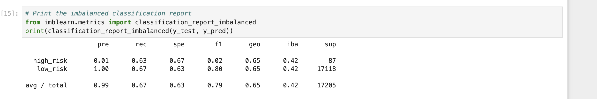

# Credit_Risk_Analysis

The purpose of this analysis was to utilize credit card datasets from an actual company (LendingClub) and use linear regression to sample and predict the data. The data was oversampled through the use of the RandomOverSampler and SMOTE algorithms, while it was under sampled using the  ClusterCentroids algorithm. After obtaining the results, The BalancedRandomForestClassifier and EasyEnsembleClassifier models were utilized to predict credit risk. 

## Undersampling

## Oversampling

## Smote Oversampling

## Combination Sampling

## RandomForestClassifier
